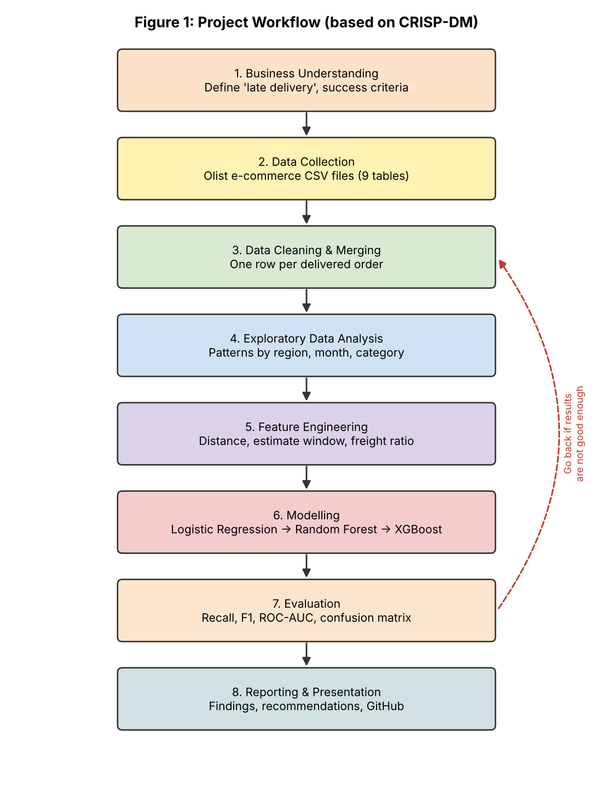
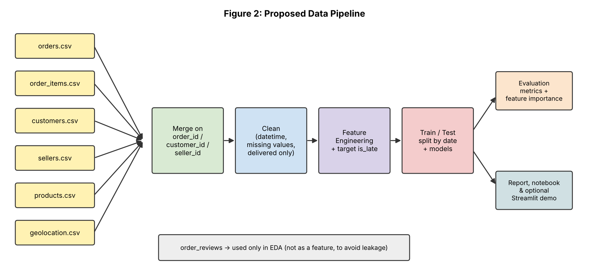
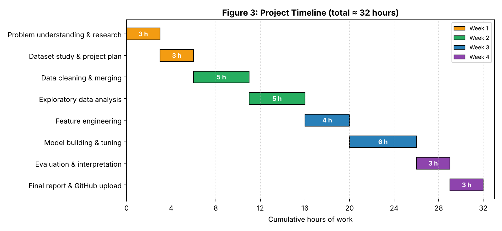
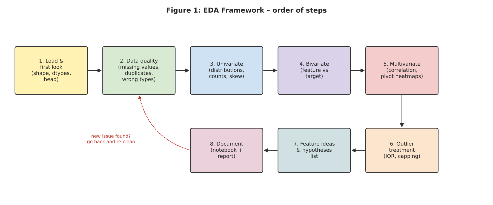
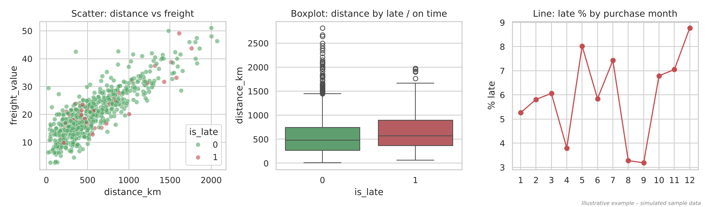
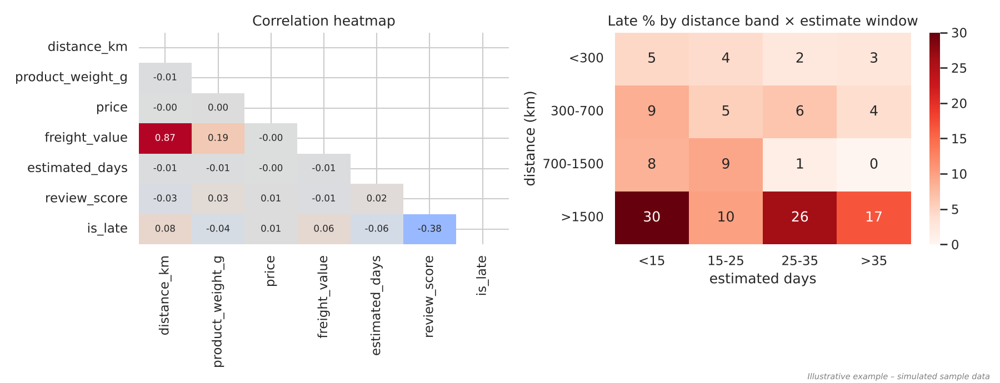
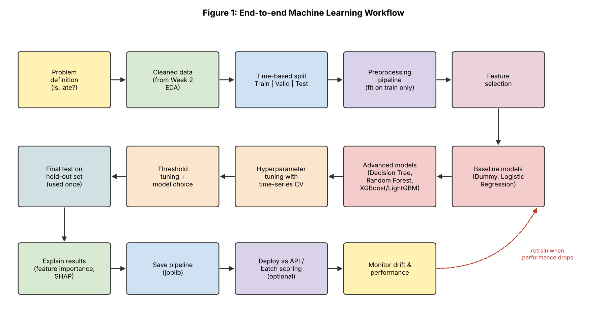
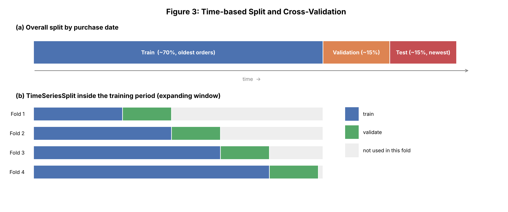

# E-commerce Late Delivery Prediction

Data science project done as part of the **Virtual Data Science Explorer Internship (Yuva Intern)**, July–August 2026.

The idea is to predict whether an online order will be delivered **after the estimated delivery date**, using order, product, seller and customer details. If late orders can be flagged early, the platform can warn customers, prioritise shipments or show more realistic delivery dates.

## Progress

| Week | Task | Status |
|------|------|--------|
| 1 | Project planning and strategy design | ✅ Done |
| 2 | EDA and visualization framework design | ✅ Done |
| 3 | ML model development and evaluation plan | ✅ Done |
| 4 | Evaluation, insights and final report | ⏳ Upcoming |

## Week 1 – Project Plan

The full plan is in [`docs/Week1_Project_Plan_Anish_Goyal.docx`](docs/Week1_Project_Plan_Anish_Goyal.docx). It covers:

- Background, motivation and problem statement
- Objectives and scope (including what is out of scope)
- Proposed dataset – [Olist Brazilian E-Commerce dataset](https://www.kaggle.com/datasets/olistbr/brazilian-ecommerce) (Kaggle)
- Methodology based on CRISP-DM: collection → cleaning → EDA → feature engineering → modelling → evaluation
- Timeline of about 32 hours across 4 weeks
- Tools and Python libraries
- Expected outcomes, benefits, challenges and how to handle them

### Diagrams

The planning diagrams were made in Python with Matplotlib (`diagrams.py`).

**Project workflow**



**Data pipeline**



**Timeline**



To regenerate them:

```bash
pip install matplotlib
python diagrams.py
```

## Week 2 – EDA and Visualization Framework

Report: [`docs/Week2_EDA_Framework_Anish_Goyal.docx`](docs/Week2_EDA_Framework_Anish_Goyal.docx)

It covers what EDA is and why it matters, the data types expected in the dataset, an 8-step EDA framework (univariate, bivariate and multivariate analysis, missing data and outlier handling), the visualization strategy, the libraries used, and a plan for reporting the findings.

**Code in `week2/`**

- `eda_framework.py` – reusable EDA functions that work on **any** pandas DataFrame (overview, missing value report, IQR outlier report, numeric and categorical plots, feature-vs-target plots, correlation heatmap, `run_full_eda()`).
- `example_charts.py` – makes the example charts used in the report.

> The Week 2 charts use a small **simulated sample** with the same columns as the expected cleaned dataset. They only show the chart types; the real analysis comes next.

```python
from week2.eda_framework import run_full_eda
run_full_eda(df, target="is_late", out_dir="eda_output")
```





## Week 3 – ML Model Development and Evaluation Plan

Report: [`docs/Week3_ML_Model_Plan_Anish_Goyal.docx`](docs/Week3_ML_Model_Plan_Anish_Goyal.docx)

It covers problem definition and justification, preprocessing (cleaning, scaling, encoding, feature engineering and selection, class imbalance), candidate models (Logistic Regression, Decision Tree, Random Forest, XGBoost) and why gradient boosting was chosen, training and hyperparameter tuning, evaluation metrics (accuracy, precision, recall, F1, ROC-AUC, PR-AUC), time-series cross-validation, and an optional deployment and maintenance plan.

**Code in `week3/`**

- `ml_pipeline.py` – scikit-learn implementation of the plan: time-based split → `ColumnTransformer` preprocessing → model comparison with `TimeSeriesSplit` → `RandomizedSearchCV` tuning → threshold selection on validation → one final test evaluation → saves the pipeline with `joblib`.
- `diagrams.py` – makes the Week 3 diagrams.

```bash
python week3/ml_pipeline.py --demo                    # checks the pipeline runs (simulated data, scores not meaningful)
python week3/ml_pipeline.py --data orders_clean.csv   # real cleaned data
```




## Problem setup (short version)

- **Type:** Binary classification
- **Target:** `is_late = 1` if actual delivery date > estimated delivery date, else `0`
- **Models planned:** Logistic Regression (baseline), Random Forest, XGBoost / LightGBM
- **Main metrics:** Recall and F1 for the late class, ROC-AUC, PR-AUC (accuracy alone is misleading because late orders are a small share)
- **Split:** by purchase date, not random, to mimic predicting future orders
- **Leakage check:** review scores are given after delivery, so they are only used in EDA, not as features

## Repository structure

```
├── docs/        # weekly reports
├── images/      # diagrams and charts
├── week2/       # EDA framework module + example charts
├── week3/       # ML pipeline template + diagrams
├── diagrams.py  # script used to make the Week 1 diagrams
├── requirements.txt
└── README.md
```

## Author

**Anish Goyal** – [github.com/anishgoyal0603](https://github.com/anishgoyal0603)
